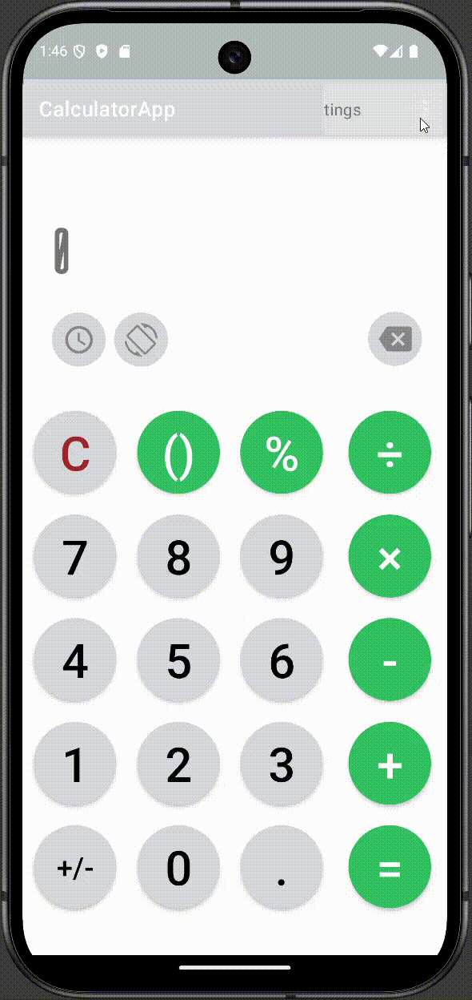
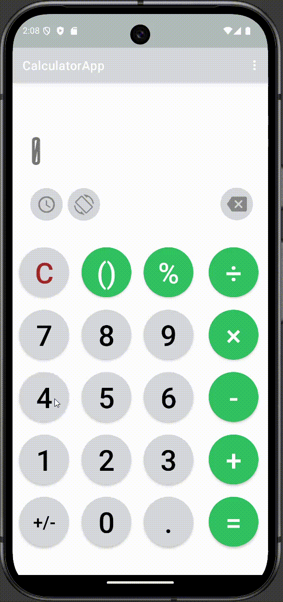
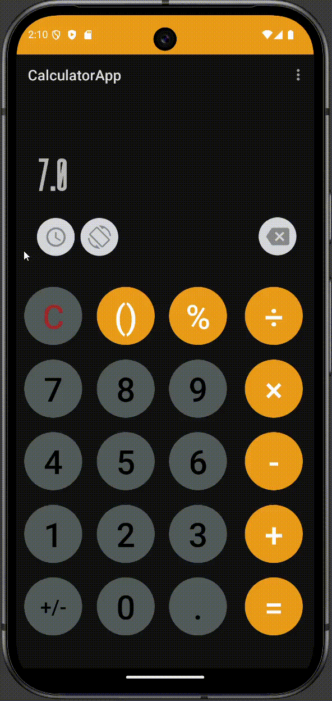

## About the Project

This project was my very first mobile application, written in **2022** as part of _Native Mobile Applications Course_.

It's a simple **Android** application that has manually written calculator logic in **Kotlin**. 

It stores calculations inside a **SQL Lite** database using **Room**. It also supports switching light and dark themes, has custom fonts, and also supports basic activity navigation. All the views have been created with a Constraint Layout.

I wouldn't be able to count the amount of Android tutorials I was watching at the time. 
I recall the requirements for this project to pass being noticeably smaller, but I was having fun and added themes and Room support despite this not being in the scope of the project. 
Now, however, it would be incredibly difficult to navigate this project as it has been a while since I last touched Android.

It's a good thing the Gemini agent is quite powerful when it comes to Android development, so I was quickly able to resolve all the dependencies after the demanded upgrade, and successfully build and run the project was using deprecated versions.

---

## Technologies Used

- **Kotlin**
- **Android Development & Android Studio**
- **Gradle**
- **SQL Lite**
- **Room**
- **Material Design**
- **View Binding**

---

## Running the Project

1. Make sure you have [Android Studio](https://developer.android.com/studio) installed on your machine.
2. Download [Gradle 8](https://gradle.org/releases/) and [JDK 21](https://www.oracle.com/java/technologies/downloads/#jdk21) on your machine
3. Let Android Studio download the necessary Gradle dependencies. Use the "_Sync Project with Gradle Files_" option if necessary
4. Prepare your emulator or a physical device and click the "_Run_" button. The device used for testing was Android 15.0 API 35

**Switching themes**

**Performing calculations**

**Viewing and clearing stored calculations**

---

_Madrid Babajev (31.01.2026)_
